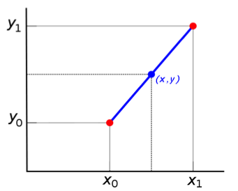

# Project 2 - Thermodynamics

The second law of thermodynamics helps us determine the quality and
degradation of energy in a process. In engineering, it is to calculate
the theoretical performance limits of systems such as heat engines
and refrigerators. Entropy is a thermodynamic property to quantify
second law effects. It is an abstract concept. Qualitatively speaking,
it can be defined as measure of disorder. For instance engineering
systems can be designed on the principle of minimizing entropy generation.
Thermodynamic tables are available for various fluids to calculate
the entropy and several other thermodynamic properties. Oftentimes
these properties are tabulated at regular intervals. For instance,
at 0.20 MPa entropy values for superheated water at various temperatures
are given in table below.

| Temperature | Entropy (kJ/kg.K) |
| ----------- | ----------------- |
| 150         | 7.2810            |
| 200         | 7.5081            |
| 250         | 7.7100            |
| 300         | 7.8941            |
| 400         | 8.2236            |
| 500         | 8.5153            |

In actual calculations, engineers may need entropy values at any temperature
(e.g., 175.3C).  If the value is not readily available, a common practice is to
apply a linear interpolation using known values. We can use the formula shown
below to calculate (x,y).

$`y = y_0 + (y_1 - y_0) \frac{x-x_0}{x_1 - x_0}`$



## Important Links

- Review the [grading rubric](https://shanepanter.com/cs117/grading-rubric.html)

## Objectives

- Use cin to read data from the user
- Use cout to output to the standard output stream
- Convert a mathematical formula to C++ code

## Task 1 - Generate Build Files

There are two scripts in the root directory named `clean.sh` and `release.sh`.
One creates a release build to compile your project and the other will delete
all the temporary files that are created during the build process.

Run the `release.sh` script from the terminal to setup your project. Note
that your output will be slightly different than what is shown below because
cmake configures the build system specific to the system that it is running on.

```bash
shane|(master *%=):solution$ ./release.sh
-- The CXX compiler identification is AppleClang 14.0.3.14030022
-- Detecting CXX compiler ABI info
-- Detecting CXX compiler ABI info - done
-- Check for working CXX compiler: /Library/Developer/CommandLineTools/usr/bin/c++ - skipped
-- Detecting CXX compile features
-- Detecting CXX compile features - done
-- Configuring done
-- Generating done
-- Build files have been written to: ...
```

## Task 2 - Write the program

Using the above background and theory develop a C++ program that asks a user for
a temperature (e.g. 169.2, 183.4, 420.7, 322.1, 400.0), calculate the entropy
value and outputs the final value.

Using the information above we can calculate the entropy of superheated water at
0.20 MPa and 175.3C.

$`s = 7.2810 + (7.5081-7.2810)  \frac{175.3-150}{200-150}`$

$`s = 7.3959 kJ/(kg.K)`$

### Sample output

```bash
$ ./myprogram
Enter a temperature in C (150-500): 169.2
The entropy is: 7.3682 kJ/(kg.K)
$ ./myprogram
Enter a temperature in C (150-500): 183.4
The entropy is: 7.4327 kJ/(kg.K)
$ ./myprogram
Enter a temperature in C (150-500): 420.7
The entropy is: 8.2840 kJ/(kg.K)
```

## Task 3 - Testing

Your instructor will provide you with testing scripts that were demonstrated in
class to help guide your development. These will be posted in canvas along with
instructions on how to use them in your project.

## Task 4 - Complete the Retrospective

Once you have completed all the tasks open the file **Retrospective.md** and
complete each section that has a TODO label. Reference the grading rubric
for details on how this will be graded.

## Task 5 - Add, Commit, Push your code

Once you are finished you need to make sure that you have pushed all your code
to GitHub for grading! You will not be submitting anything to canvas everything
will be submitted through GitHub as demonstrated in class.
